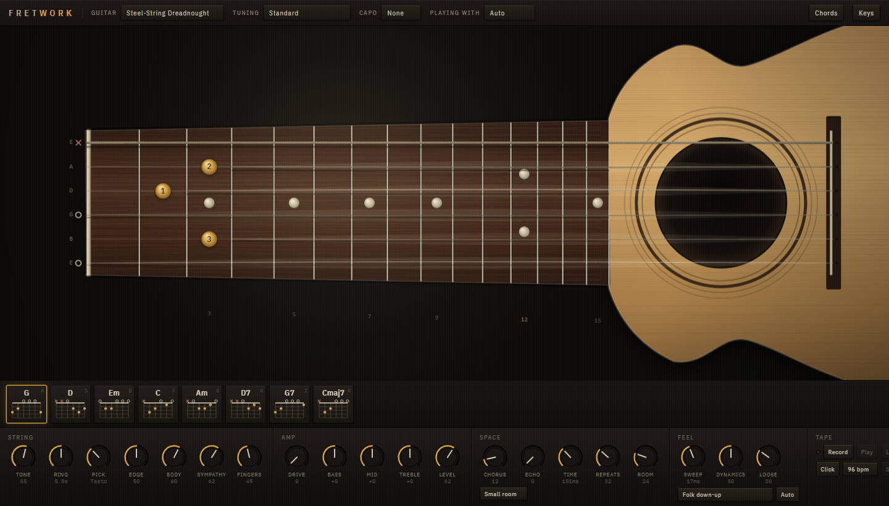
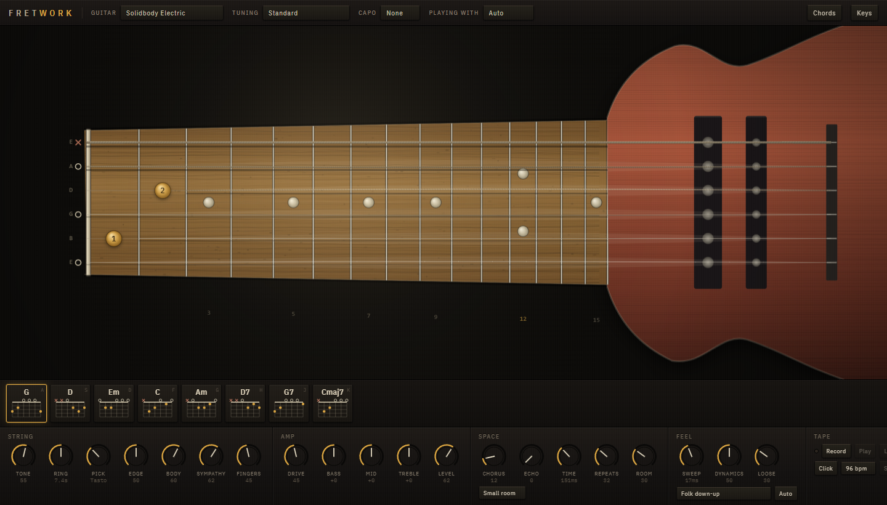
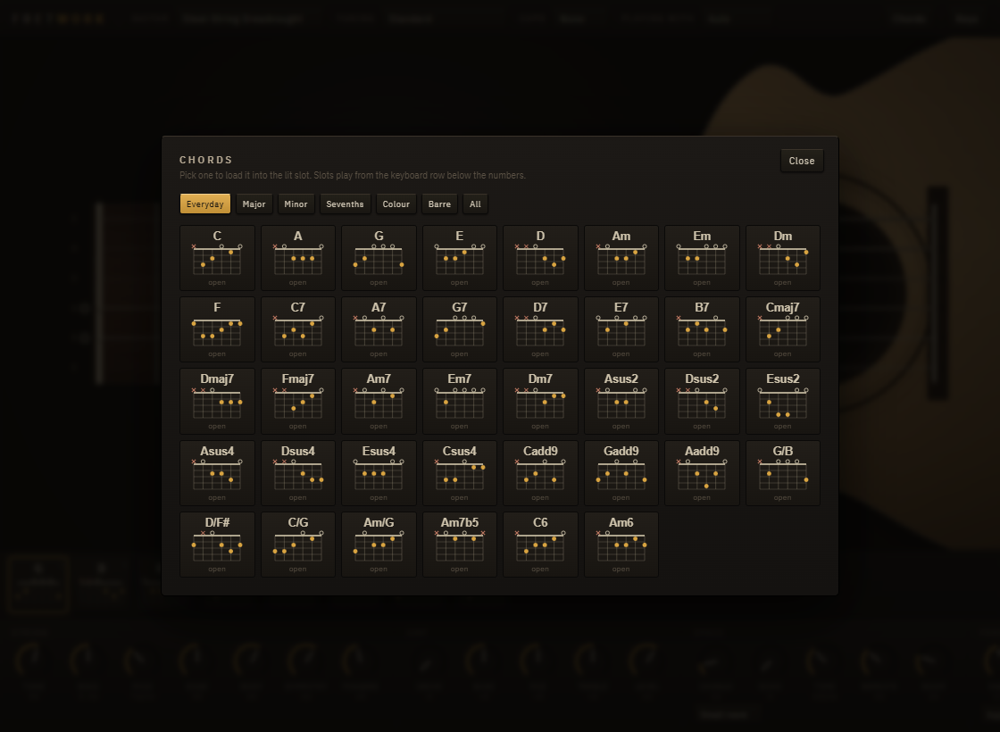
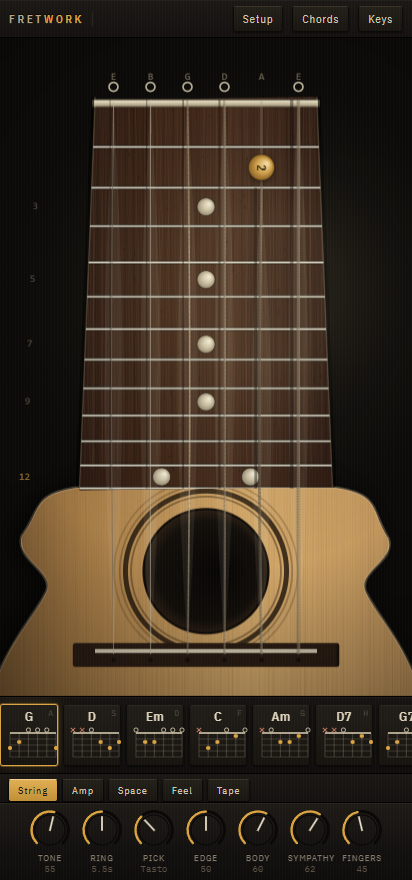

# fretwork

A playable guitar in one HTML file. There are no samples anywhere in it: every
note comes from six coupled digital waveguides running inside an
AudioWorklet, synthesized from scratch on every pluck.

Play it at https://kernelspecter.github.io/fretwork/, or download
`index.html` and open it directly: no server, no build step, no dependencies.
It also runs from a local server (`python -m http.server`, or similar) if you
prefer that. On Chrome, loading the audio worklet from a `blob:` URL fails
when the page was opened as `file://`, because the page's origin is opaque
there, so the worklet is loaded from a `data:` URL instead, which works from
both a file and a server, and the blob path is kept only as a fallback.



## Playing it

Touch and mouse work the way a real guitar does: drag along a string on the
neck to fret it, drag across the soundhole to strum, and touch and mouse both
support several fingers or strings at once. Faster drags strum harder.

The full keyboard map:

| Key | Does |
|---|---|
| A S D F G H J K | Hold a chord from the rail and strum it down |
| Space | Strum down. Hold shift for an upstroke |
| 1 2 3 4 5 6 | Pick one open or fretted string, low E through high E |
| X | Muted chuck |
| M (hold) | Palm mute |
| Q (hold) | Touch harmonic on the next pluck |
| Up / Down | Softer or harder |
| Left / Right | Move the capo |
| Enter | Start and stop the strum pattern |
| R | Record |

A and D and K, by default, hold G, Em, and Cmaj7. An upstroke is not just a
downstroke played backwards: it leaves the bottom string or two behind,
sweeps faster, and catches closer to the bridge, so the two directions
actually sound different, not just labeled differently.

A gamepad works too: the four face buttons and four D-pad directions hold
eight chord slots, the shoulder buttons move the capo, and the right stick
sweeps across the strings the way a finger would, a slow tilt strumming
slowly and a fast one strumming fast. Any MIDI input plugged in is listened
to as well, each note on routed to whichever string can reach that pitch
below the twelfth fret, closest string first. The input mode is auto
detected from what is present and the header lets you override it.



## How the sound is made

Each string is an extended Karplus-Strong loop: a delay line read with
4-point Lagrange interpolation, a one-pole damping filter, and a feedback
gain picked from the decay time you asked for. Plucking loads a triangular
displacement shape into the delay line, peaking at the pluck point rather
than a symmetric impulse. A triangle's harmonic amplitudes fall off as
sin(n·pi·beta)/n^2, the actual spectrum of a plucked string, and it gives the
pluck position nulls for free: pluck at a fifth of the string and the fifth
and tenth harmonics fall away on their own, no extra filtering required.

Tuning a delay-line loop is not just delay length equals sample rate over
frequency. The one-pole filter inside the loop adds its own phase delay, and
if that is not subtracted from the delay line length, every note comes out
flat, worse the higher up the neck you go: `baseDelay = rate/f0 -
onePolePhaseDelay(g, w0)`.

The six strings share a bridge, which makes them a feedback network, not six
independent loops. Two strings coupled by an amount `c` go unstable once
`loopGain + c > 1`, and six coupled in phase go unstable at `loopGain + 5c >
1`. Each string's share of the bridge signal is scaled to its own loss, so
the whole instrument stays under that ceiling no matter what tuning or decay
time is set.

Re-plucking a string that is still ringing means dropping a new waveform into
a delay line mid-cycle, a step discontinuity if done carelessly. The fix is a
counted cosine crossfade: it reaches exactly zero, with zero slope, right
before the reload, and leaves zero with zero slope on the way back up. A
re-pluck ends up no sharper an attack than a fresh one.

The body is a parallel bank of bandpass filters standing in for the air and
top and back plate modes, cheaper than a convolution and adjustable in real
time by the Body knob, with two banks tuned slightly apart making the stereo
width. Pickup position is modeled as a feedforward comb filter that subtracts
a delayed copy of the string signal, the delay set by where the pickup sits
along the string: a real pickup only reads the string's motion at one fixed
point, so it cancels whatever harmonic has a node there, which is most of
what makes an electric guitar sound like its pickup position rather than
like a generic string.

What you hear between the chords is not the same generator as what you hear
in them. A fingertip pressed into a wound string and dragged along it does
not hiss: it crosses the windings one at a time, and the rate of those
crossings is the pitch of the squeak. The arithmetic is speed over winding
pitch, and both halves come out of data the instrument already carries, the
fret spacing from its scale length and the winding pitch from the string
gauge. A hand accelerates off the mark and brakes onto the target, so its
speed over the move is a bell and the squeak is a chirp, rising and falling
rather than sitting still.

What makes that chirp sound metallic is a harmonic series, not a single band.
Sweeping a narrow resonance along with the crossing rate gives the right
pitch and almost nothing above it: measured, the second harmonic came out 14
dB down and only 2.4% of the energy sat above 3 kHz, which is a whistle, not
a scraped string. So the crossings drive a comb tuned to their own period
instead, exactly as the string itself is a delay line tuned to its pitch, and
the whole series comes out with it: the second and third harmonics now stand
above the fundamental, there is still usable energy at 9 kHz, and a third of
the total sits above 3 kHz. The comb is read with the same 4-point Lagrange
interpolation as the strings, which is what makes a delay length that moves
every sample safe to sweep. The pitch is then measured by correlation rather
than by spectral centroid, because a centroid over a spectrum full of
harmonics mostly reports how many of them fit under the shaping filter: it
moved by 9% across a sweep that tripled in pitch.

The rules about when a hand can squeak at all are physical, which is what
keeps it from sounding sprayed over everything. The thin wound D squeals
higher than the low E for the same reason a real one does; the plain trebles
do not squeak, having no windings to skip; and nothing is dragged off an open
or a muted string, there being no finger on it. Notes a fret or two apart are
reached with a different finger rather than by sliding one along, so they make
no squeak at all, which is what stops a melodic line squealing on every note:
walking up the low E in whole tones peaks ten times quieter than one shift out
of position. Only a move past the span of the hand drags, and even then it
catches about two times in five rather than every time, a little more often
the further the hand has had to go.

Each squeak is scheduled to end where the note begins, so it sounds in the
gap ahead of the chord rather than underneath its attack, where it would
simply be masked. A finger dragged along the neck by hand gets one long
rising squeak instead of one per fret, and a squeak cut short by the next one
is released rather than dropped, because an envelope that steps to zero is a
click. It sits about twenty decibels under a plucked note, measured against
one. The Fingers knob sets how much of it there is, or none at all.



## The reference data

Nine tunings, four instrument bodies (steel-string dreadnought, nylon
classical, solidbody electric, archtop jazz, each with body mode frequencies,
Q, and gain sourced from published measurements cited in the data itself), 96
chord voicings, 11 strum patterns, 16 chord progressions, and 6 pluck
positions live in a JSON block in the page. `dev/check-data.mjs` builds every
voicing note by note from the open string pitches and checks it against its
own name: no notes outside the chord, the required intervals present, a
slash chord's stated bass actually the lowest note, no span wider than 4
frets, no finger asked to hold two frets at once. It also recomputes every
tuning frequency from equal temperament and checks that every progression
only names chords that exist. The 16 progressions are what the arranger builds
songs out of; `dev/song.mjs` additionally checks that each one names a key,
that every key has a second progression to build a chorus from, that every key
has a shape for its own tonic, and that every suggested pattern exists.

## Effects and the reverbs

The signal runs from the strings through a compressor, an optional overdrive
stage, a three-band EQ, an electric-only speaker cabinet convolution, a
two-voice chorus built from a pair of modulated short delays, a feedback
echo, and a reverb, into a limiter. None of the six reverb spaces (small
room, live room, hall, plate, stone church, spring tank) are recorded impulse
responses: each is synthesized the moment the page loads, from noise shaped
by a decay envelope and a handful of early reflections, except the spring
tank, built from dispersive chirps sliding downward in pitch, the actual
mechanism of a real spring reverb's boing. Nothing is fetched, so nothing can
fail to load.

## Playing a song you already have

`Open`, or drop a file anywhere on the page. Three kinds work.

**A recording** — mp3, wav, m4a, ogg, flac, anything the browser can decode.
It listens to it and works out what to play: the tempo from the onsets, the
key and the chord under each bar from a chroma fold, and then a real shape for
every chord and a strum to play them with.

Be clear about what that is and is not. Pulling every individual note out of a
finished mix is an open research problem, and the things that do it well are
trained neural networks far larger than this whole page. This does what a
guitarist does with a record: finds the tempo, the key, and the chord under
each bar. That is well understood signal processing with no model in it, and it
is right about nineteen times in twenty on a clean recording of one
instrument, decent with drums over it, and on a dense produced mix it will
follow the changes without being reliable bar by bar. So it tells you how
sure it is, the chart fades the cells it is least confident about, and a low
score says so in words instead of hiding it. Treat a busy mix as a first
guess to correct by ear, which is what a chord sheet off the internet is
anyway.

Three things worth knowing about the method, all of which were wrong first and
found by measuring on a real recording rather than on the synthetic signals
that already worked.

The largest: normalise once, after aggregating, never per frame. Scaling each
frame so its loudest pitch class is 1.0 and *then* averaging a bar of them
lifts anything that was ever briefly loudest, and the result comes out nearly
flat. On a real mix every pitch class sat between 0.74 and 0.99, whichever
three were marginally highest won, and a whole track came back as one chord
held from beginning to end at 45% confidence. It looks plausible, which is the
worst kind of wrong. Aggregating first, normalising once and squaring to
sharpen took that track to two chords alternating at 81%, and the synthetic
cases from 89% to 97%. Related: a harmonic is a peak standing *above* the
noise around it, so only the part standing above is counted; compressing the
raw magnitude with a log instead lifts the floor until the bleed between the
notes contributes as much as the notes. A note brings its own overtones with it and they are not
it: the third harmonic of a G is a D and the fifth is a B, so a G chord folded
straight onto twelve pitch classes reads its own overtones louder than its
root and comes out as B minor. Every pitch class therefore gets credit for the
harmonics it would have produced. And the beat phase says where *a* beat is,
not which beat is beat one; getting that wrong smears two chords into every
bar. So all four positions are tried and the one the harmony agrees with is
kept, because a bar line in the right place makes every chord in it fit better
at once.

It picks out the tune as well as the chords, because that is the thing a song
is recognised by. A guitar strumming two chords for eighty seconds sounds like
a guitar strumming two chords, however right the chart is. So one line at a
time, which is the tractable version of the problem: for every frame, which
single pitch best explains the peaks that are there, summed over its own
harmonics. Frames get tidied into notes, snapped to the sixteenth grid the
tempo already found, and handed to the same pass that lays out a MIDI file,
because putting notes on a neck is the same problem either way. `Tune` turns
it off and leaves the chords, which drop to a sparser strum when there is a
melody over them.

Two things that matter in a pitch tracker. An octave down explains the same
peaks as the note itself, and a tune that drops an octave at random stops
being the tune, so among candidates that fit almost as well the highest wins:
a melody is nearly always the top line. And the voiced/unvoiced decision has
to be an absolute figure, not a percentile — a percentile discards a fixed
share of every recording however much of it is singing, and at the 55th it
lost nearly half the notes of a plain monophonic line.

**A tab** — MusicXML, which is what every notation program exports and what
tab sites hand out: Guitar Pro, MuseScore and Sibelius all write it. This is
the only input to the page that is not a guess. The listener infers, the
arranger invents, and the MIDI importer works out where on the neck a pitch
might go; a tab already knows, because somebody worked out the whole
arrangement, and for a guitar part they also wrote down which string and
which fret. So where the file says string three fret two, that is what gets
played, at the moment the file says, with the finger the file names, and the
cost model that guesses at positions is not consulted at all. If you want a
piece played exactly, this is the way to do it.

Where a file gives both a written pitch and a string and fret that disagree —
a transposing editor or a capo setting will do that — the tab wins, because
that is what a guitarist plays off the page, and the count of disagreements is
reported rather than passed over. A score with no tab staff still plays; its
notes go through the same placement pass as a MIDI file. `.mxl` is a zipped
MusicXML and is refused with an explanation: export it uncompressed.

**A MIDI file** — every note, where the file put it. A MIDI file says which
notes and when, never where on the neck, and that is the whole problem: each
pitch can be played in up to six places, a string sounds one note at a time,
and a hand reaches about four frets. Each note is given a string and a fret by
what it costs the hand to reach, preferring an open string, staying in
position, and avoiding taking a string that is still ringing. A part outside
the guitar's range is moved by whole octaves to where the fewest notes fall off
the end.

**A chord sheet** — plain text, `| G | D | Em | C |`, or just chord names, with
an optional `bpm:`, `pattern:` or `title:` line and `%` to repeat a bar. Names
it does not know are reported rather than guessed at.

## Seeing how it is played

`Fingers` draws the fretting hand on the neck: palm under the board, a thumb
hooked behind it, and one numbered finger per fret in use reaching up to the
notes being held. A finger holding several strings at one fret is drawn barring
them, because that is what it is doing. The four fingers are tinted apart, but
dustily: this is a workbench under a lamp, and four saturated colours across
the fretboard would be the loudest thing on the page. The other hand shows up
near the bridge as the direction of the last stroke, or the string a single
note was picked on, so a picked part shows both hands and not only the left
one.

Two things this got wrong first. Each knuckle has to sit under the fret its own
finger is holding; spreading them by finger number instead put finger three's
knuckle under finger one's fret and the two reached across each other, which is
not a hand any more. And the finger number used to be drawn only when the fret
dot was above a certain size, so on a narrower window it never appeared at all.

A chord out of the reference data
uses the fingering the data gives it. Anything else has no name and no
fingering to look up, so one is derived: one finger per distinct fret, lowest
first, which means several strings at the same fret come out as one finger
barring them. That is the right reading for a handful of notes nobody has
named, and it is how an imported file is shown as it plays. The hand travels
with each note rather than being looked up when the note sounds, because the
player queues ahead of the speakers.

## Composing a whole song

`Compose` derives an entire arrangement from a single 32-bit number, and
`Play` performs it: intro, verses, choruses or a bridge, turnarounds into each
section, and an ending. `Chart` writes it out as a lead sheet with the current
bar lit. The seed goes in the address bar, so a song is a link.

The harmony is not invented. Every progression in the reference data names its
own key, and a section is only ever built from a progression already in that
key, so a spliced arrangement cannot wander out of key however the dice fall.
What is derived is the shape: which progression goes where, how many bars each
section runs (always a whole number of cycles, so a phrase is never cut off
mid-way), which strum pattern and how hard, where the turnarounds land, and
where it stops.

The choices are read off the data rather than hard-coded. A pattern's
*density* is how many of its eight slots are struck, and its *peak accent* is
how hard the hardest one is hit; nothing in the bar above 0.8 means no hand is
hitting the whole chord, so that pattern gets fingerpicked, with the thumb
holding the bass on the strong slots while the fingers walk up whatever else
the shape is holding down. Sparse patterns go to the intro and outro, dense
ones to the chorus. A chorus is taken up the neck on a barre where the chord
has a shape up there. Verse two is played a little harder than verse one.

The chord shapes are standard-tuning fingerings, so composing puts the
instrument back to standard tuning with no capo rather than quietly playing
something else and calling it a G.

`ARRANGER` lives in its own `<script id="arranger">` block with no DOM, no
audio and no clock in it, which is why `dev/song.mjs` can pull it straight out
of the page and check it in node.

## The tape

Record captures what the instrument actually produced, effects chain
included, but never the loop already playing back, so overdubbing does not
re-record the previous take on top of itself. Loop plays the take back
looping, and overdub adds a new take onto the existing one. A take comes back
out of the audio graph later than it went in, by the graph's round trip
latency, so the overdub write position is shifted back by that measured
latency before the two takes are summed, keeping layers aligned instead of
drifting apart the more you overdub. Export renders the loop to a 16-bit
stereo WAV file you can save.

## Running the tests

The page itself has no dependencies. The harnesses need Playwright, which is
the only thing in `package.json`:

```
npm install
npm test
```

They drive whichever Chrome is already installed. If there is not one,
`npx playwright install chromium` gets a copy. Individually:

```
node dev/verify.mjs        # the DSP engine, loaded straight out of index.html
node dev/check-data.mjs    # the chord and tuning data
node dev/song.mjs          # the arranger, pulled out of index.html
node dev/song.mjs --show   # print a derived song as a chart
node dev/import.mjs        # the MIDI and chord sheet importer
node dev/tab.mjs           # the MusicXML tab reader
node dev/listen.mjs        # what it hears in a recording, against signals it builds
node dev/listen.mjs --show # print what it heard in each one
node dev/keys.mjs          # every documented key, in a real browser
node dev/qa.mjs            # pointers, the tape, the sequencer, resizing, knob extremes
node dev/verify.mjs --wav  # renders dev/demo.wav if you would rather listen
```

The DSP harness reports 26 of 26 checks passed: worst tuning error across the
fretboard is 0.05 cents, the low E decays in 5.35 seconds against a requested
5.5, a 30 second six-string ring stays finite with no NaNs and a tail
4.07e-13 by the end, a re-pluck's worst sample-to-sample step is 0.01126
against 0.01126 for a fresh pluck (no sharper), plucking near the bridge
measures a spectral centroid of 238 Hz against 157 Hz over the neck,
plucking at a fifth of the string suppresses the fifth harmonic by 21.9 dB
and the tenth by 8.5 dB relative to their neighbours, and a scheduled
six-string strum lands within 2 samples of where it was told to fire. Two more
check the paths the interface actually uses: a note handed an absolute
AudioContext time fires within 1 sample of it, a six string strum arrives
spread over 60 ms rather than as one block chord, and a capo carries a
ringing fretted note up with it, 146.8 Hz to 164.8 Hz, by sliding rather
than jumping. Six more cover the squeak, and the first two of those are the
only reason it is audible: it sounds on a string that is not ringing at all,
and its crossing rate measures 1263 Hz rising to 2182 Hz and falling back to
1371 Hz across a single 90 ms move rather than holding one number. It leaves
and arrives at zero, it does not light the string up on the neck or count as
ringing when the next note decides whether it has one to choke, the thin
wound D squeals at 3990 Hz against 2350 Hz for the low E, and a squeak cut
off by the next one is released rather than dropped, which is measured on the
string alone because the body resonators ring for long enough afterwards to
hide the difference. The
data checker reports 96 voicings, 9 tunings, and 16 progressions checked, no
problems found. The keyboard harness presses every documented key in a real browser and
checks what the engine was actually told to do, 32 of 32 passing, including
that an upstroke really does reach fewer strings than a downstroke. The wider
harness drives pointers (two at once), all four guitars, all nine tunings,
all six spaces, every knob at both extremes, the tape end to end including
the WAV header fields, the sequencer while everything under it changes, and
eight viewport sizes from 200x200 to 2560x700: 74 of 74 passing, with the
worst peak anywhere in that sweep measuring 0.92 of full scale. It also
measures the capo from the audio that comes back out of the tape rather
than from the message that went in, within half a cent at the nut, the
second fret and the fifth, and it times a strum through the real worklet
clock: a note asked for 0.3 seconds ahead lands 0.308 seconds late, and a
six string strum sweeps across roughly 150 ms instead of landing as one
block chord. That last one is the seam where the two halves meet, and it
is the only place both other harnesses could pass while the instrument
was wrong.

## What it does not do

There is no sample playback of any kind, so it will not sound identical to a
particular recorded guitar the way a sampled instrument can. There is no
physical model of the fretting hand (no independent finger tension curves, no
real fret buzz), and the body model is a filter bank tuned to published mode
frequencies, not a convolution against a measured impulse response of one
actual instrument, so it approximates a body's resonance rather than
reproducing a specific guitar's. There is no save or load of a session,
project file, or tab: the only persistent output is the WAV export. It does
not remember your settings between visits, and there is no undo for a tape
beyond clearing it and starting over.



## Licence

MIT. Copyright KernelSpecter.
